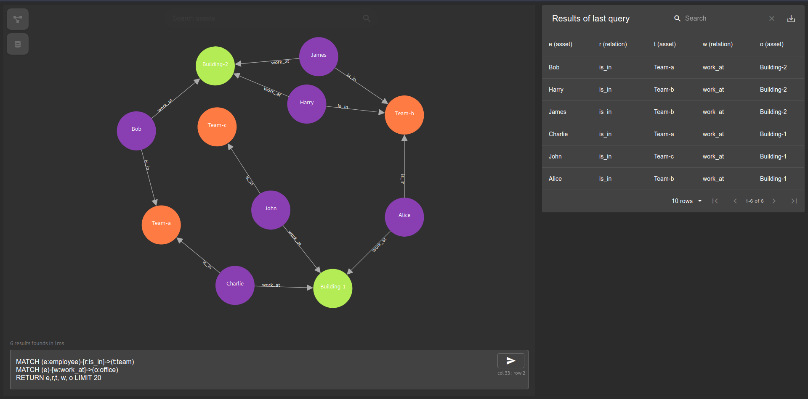

# go-graphkb

go-graphkb is a Graph-oriented Knowledge Base written in Go.

The Knowledge Base can be queried using [openCypher](https://github.com/opencypher/openCypher)
and results can be visualized in the UI as shown below.

## Getting started

Run the following commands

    # Spin up a mariadb in few seconds with
    docker-compose up -d

    # Wait a few seconds for the db to be ready before
    # inserting the example data available in examples/
    # with the following command.
    go run cmd/go-graphkb/main.go start

    # In another terminal start the web server with the following
    # command to acces the web UI at http://127.0.0.1:3000
    go run cmd/go-graphkb/main.go listen

## LICENSE

**go-graphkb** is licensed under Apache 2.0.
